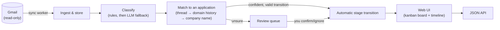

# Sift

A self-hosted job application tracker that updates itself. Sift watches your
Gmail inbox, classifies incoming mail against the applications you're
tracking (rejection, interview invite, offer, assessment request, ...), and
keeps your pipeline current without you copy-pasting status updates into a
spreadsheet.

**Status**: feature-complete for a first self-hosted release.

## The problem

Every application tracker — a spreadsheet, Notion, a paid tool — goes stale
the same way: the data only updates when a human remembers to update it, and
after a few dozen applications nobody does. Sift instead treats your inbox as
the source of truth and reconciles your tracked applications against it.

## How it works



- **Sync worker** polls Gmail on an interval, using the History API for
  incremental sync after the first backfill.
- **Classifier** is two-tier: free sender-domain/keyword rules first, and
  only mail the rules can't confidently place goes to an LLM (Claude Haiku)
  fallback. Each email is processed exactly once — ingestion is idempotent
  on Gmail's message ID, so there's nothing to separately cache.
- **Matcher** links an email to a tracked application via thread continuity,
  then sender-domain history (excluding shared ATS domains like
  `greenhouse.io`, which tell you nothing about which company sent the
  mail), then a literal company-name match. A confident match only
  auto-advances the pipeline if the resulting stage transition is one the
  state machine actually allows from the application's current stage —
  otherwise it stays linked, unadvanced, for you to resolve by hand.
  Anything below the confidence bar goes to the review queue instead of
  being silently (and possibly wrongly) auto-linked.
- **Web UI** is server-rendered Go templates plus htmx — no SPA, no separate
  frontend build step. The whole app is one binary.

## Quickstart (Docker)

```sh
git clone https://github.com/prashantkoirala465/sift && cd sift
cp .env.example .env   # fill in the values below
docker compose --env-file .env -f docker-compose.prod.yml up -d --build
```

Sift will be listening on `:8080`, migrated and ready. You'll need to fill in
a few environment variables first — see below.

### Required environment variables

| Variable | Required | Description |
|---|---|---|
| `SIFT_DB_PASSWORD` | yes (prod compose) | Postgres password for the `sift` user |
| `SIFT_ENCRYPTION_KEY` | yes | Base64-encoded 32-byte AES-256 key. Generate with `openssl rand -base64 32`. Encrypts OAuth tokens at rest — losing it means reconnecting Gmail. |
| `SIFT_AUTH_PASSWORD` | strongly recommended | Gates the entire web UI and API behind HTTP Basic Auth. There's no other authentication in the system — see [Security](#security). |
| `SIFT_GOOGLE_CLIENT_ID`, `SIFT_GOOGLE_CLIENT_SECRET`, `SIFT_GOOGLE_REDIRECT_URL` | for Gmail sync | See [Connecting Gmail](#connecting-gmail) below. Sift runs without these; `/auth/google` just 503s until they're set. |
| `SIFT_ANTHROPIC_API_KEY` | no | Enables the LLM classification fallback. Without it, Sift classifies with rules only — lower recall on ambiguous mail, same correctness guarantees otherwise. |
| `SIFT_SYNC_INTERVAL` | no | How often the sync worker polls Gmail. Default `5m`. |
| `SIFT_ADDR` | no | Listen address. Default `:8080`. |

### Connecting Gmail

Sift needs its own OAuth client — there's no shared/hosted one, this is a
self-hosted tool.

1. In the [Google Cloud Console](https://console.cloud.google.com/), create a
   project (or reuse one) and enable the **Gmail API**.
2. Under **APIs & Services → Credentials**, create an **OAuth client ID** of
   type "Web application".
3. Add an authorized redirect URI matching where Sift is reachable, e.g.
   `http://localhost:8080/auth/google/callback`.
4. Set `SIFT_GOOGLE_CLIENT_ID`, `SIFT_GOOGLE_CLIENT_SECRET`, and
   `SIFT_GOOGLE_REDIRECT_URL` (the exact URI from step 3) in your `.env`.
5. Start Sift, then visit `/auth/google/login` and grant access. Sift
   requests only the `gmail.readonly` scope — it can never send, delete, or
   modify anything in your mailbox.

If your Google Cloud project is in testing mode, only test users you add in
the OAuth consent screen can complete the flow.

## Development

```sh
make db-up      # Postgres in Docker
make run        # go run ./cmd/sift (needs SIFT_DATABASE_URL, SIFT_ENCRYPTION_KEY)
make test       # unit tests; set SIFT_TEST_DATABASE_URL to also run Postgres/HTTP integration tests
make lint       # golangci-lint
```

Regenerating type-safe query code after editing anything in
`internal/storage/postgres/queries/`:

```sh
sqlc generate
```

## API

All endpoints under `/api` return JSON. The web UI at `/` uses the same
underlying store through server-rendered handlers, not this API.

| Endpoint | Description |
|---|---|
| `POST /api/applications` | Create an application |
| `GET /api/applications` | List applications |
| `GET /api/applications/{id}` | Get one, with its full stage-event history |
| `POST /api/applications/{id}/stage` | Manually record a stage transition (409 if the state machine rejects it) |
| `GET /api/review-queue` | List emails awaiting review |
| `POST /api/review-queue/{id}/confirm` | Link an email to an application; applies the implied stage transition if the state machine allows it |
| `POST /api/review-queue/{id}/ignore` | Dismiss a review-queue item |
| `GET /healthz` | Unauthenticated health check |
| `GET /debug/vars` | expvar metrics (sync ticks, classification/match counts, HTTP status classes) |

## Security

- **OAuth scope**: `gmail.readonly` only. Sift cannot send, delete, or
  modify anything in the connected mailbox.
- **Tokens encrypted at rest**: OAuth access/refresh tokens are AES-256-GCM
  encrypted before they ever reach Postgres, using a key that lives only in
  the process environment (`SIFT_ENCRYPTION_KEY`). A database dump alone
  isn't enough to act as the connected account.
- **XSS**: the web UI renders email subject lines and snippets pulled
  directly from your inbox — attacker-controlled input the moment a
  phishing email lands in it. Pages use `html/template`, not
  `text/template`, specifically for its context-aware auto-escaping.
- **No third-party runtime dependencies**: htmx is vendored, not loaded from
  a CDN. A tool that reads your email shouldn't also be fetching JS from a
  third party at runtime.
- **Authentication**: HTTP Basic Auth via `SIFT_AUTH_PASSWORD`, checked with
  a constant-time comparison. This is intentionally minimal — one
  legitimate user per instance, no session store. **If you don't set it,
  the web UI and API are completely open to anyone who can reach the port.**
  Sift warns loudly on every boot when it's unset, but does not refuse to
  start, to keep local development simple.
- **CSRF**: browsers auto-attach cached Basic Auth credentials to any
  request to an origin they're cached for, including one a malicious page
  on another site triggers — Basic Auth alone doesn't stop this. Every
  state-changing request is checked against its `Origin`/`Referer` header
  (falling back to `X-Forwarded-Host` behind a reverse proxy) and rejected
  if it doesn't name this host. Requests with neither header — direct API
  use, curl, scripts — aren't browser-driven and are let through.
- **Known limitation**: Basic Auth over plain HTTP sends your password on
  every request. Put Sift behind TLS (a reverse proxy like Caddy or Nginx,
  or a tunnel like Tailscale/Cloudflare Tunnel) for anything beyond
  localhost — Sift itself does not terminate TLS.

## License

MIT — see [LICENSE](LICENSE).
